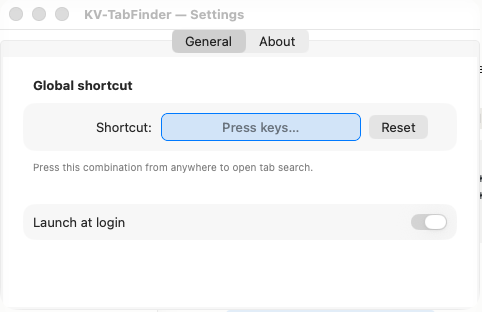

# KV-TabFinder

Spotlight-style tab search for macOS. Press a shortcut → get every open tab across Safari, Chrome, Chromium, Arc, Brave, Edge, Vivaldi and Opera in one fuzzy-searchable list → press Enter to jump to it.

## Install

**[⬇ Download KV-TabFinder.dmg](https://slava-konashkov.github.io/KV-TabFinder/KV-TabFinder.dmg)** — always the latest stable build.
Older versions live on the [Releases page](https://github.com/slava-konashkov/KV-TabFinder/releases).

1. Open the downloaded DMG.
2. Drag **KV-TabFinder** into **Applications**.
3. Launch the app from Applications.
4. A magnifying-glass icon appears in the menu bar.

The first time you open the app macOS will show an "unverified developer" warning — **right-click → Open** once, allow it. After that it launches normally.

## First run

Press **⌥⇥** (Option + Tab).

macOS will ask permission to control each browser you have open:

Click **OK** for every browser. KV-TabFinder only reads tab titles and URLs — nothing else.

## Usage

| Action | Shortcut |
|---|---|
| Open search | **⌥⇥** (configurable) |
| Next / previous result | ↓ / ↑ |
| Jump to tab | ↩ Enter |
| Close panel | ⎋ Escape |

Start typing to filter — matches against both **title** and **URL**. Fuzzy: `gh pr` finds *GitHub Pull Request*.

Tabs from different Chrome profiles render with a colored badge per account, so work / personal / side-project tabs stay distinguishable.

## Settings

Menu-bar lupa → **Settings…**

- **Shortcut** — click the shortcut field and press a new combination.
- **Launch at login** — start KV-TabFinder automatically.

## Known limitations

- **Firefox** isn't supported — Firefox has no AppleScript API for tabs.
- **Chrome Incognito** tabs aren't listed — Chrome's own policy.
- macOS will prompt for Automation permission once per browser on first access.

## Requirements

- macOS 13 Ventura or later
- Apple Silicon or Intel Mac

## Feedback

For issues, feature requests, or questions use [this repo's Issues tab](https://github.com/slava-konashkov/KV-TabFinder/issues). Source code is kept in a private repository.
